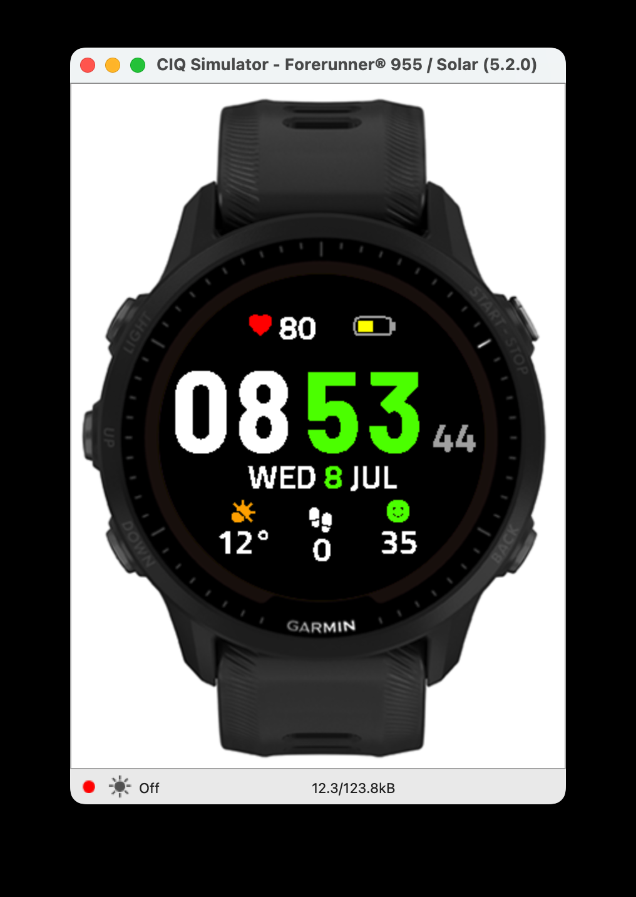
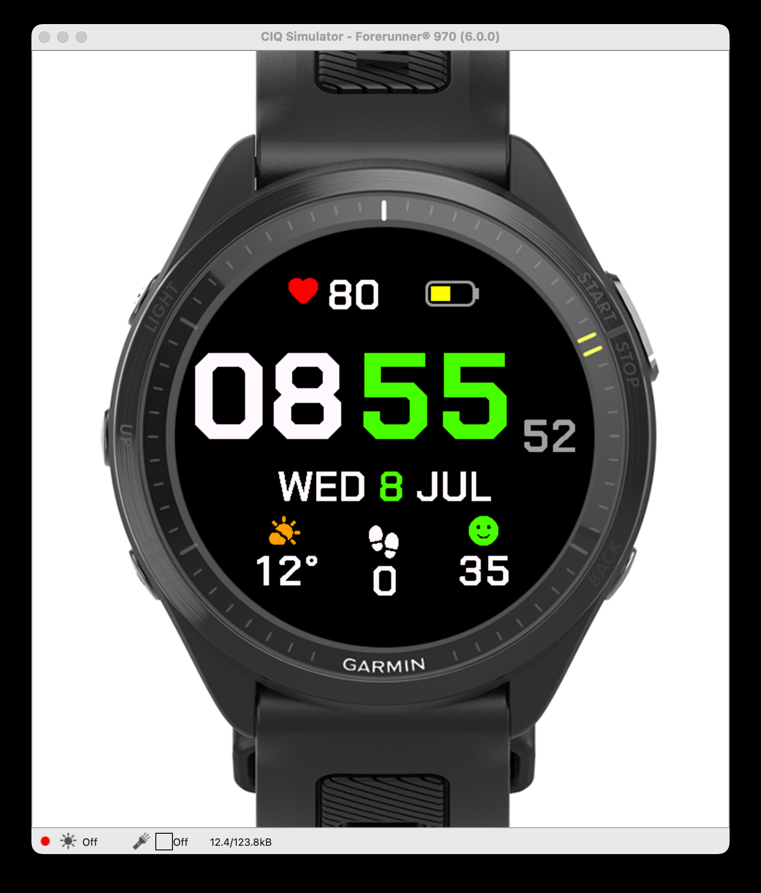

# Garmin 运动表盘 · TEMPO & PULSE

为 Garmin Forerunner 系列设计的数据型表盘，用 **Connect IQ SDK** + **Monkey C** 开发。
双色大字时间为视觉主角，配合心率、电量、步数、天气、压力等日常数据，图标随数值变化。

同一套布局、两款字体气质，是**两个独立 app**（各自 app id，可同时装到表上）：

| | 字体气质 | 说明 |
|---|---|---|
| **TEMPO** | 圆体（Barlow SemiCondensed + Titillium Web） | 初版，时间大字更高 |
| **PULSE** | 棱角（Chakra Petch） | 直线为主，MIP 屏上锯齿更少 |

<p align="center">
  
  &nbsp;&nbsp;
  
</p>
<p align="center"><em>左：TEMPO / fr955（260×260 MIP）　右：PULSE / fr970（454×454 AMOLED）</em></p>

## 功能（两款一致）

- **时间**：时分双色大字（时白、分跟随主题色），秒以小字缀于右下，低功耗下每秒仅局部刷新
- **心率**：实时心率，无值时回退到最近一次历史采样
- **电量**：纯图标电池，按电量比例填充，绿 / 黄 / 红三档变色（无百分比数字）
- **步数**：完整数值，居中格加宽以容纳 5 位数
- **日期**：周几 + 日 + 月缩写，日数用主题色点缀
- **天气**：温度 + 图标随天气状况切换（晴 / 少云 / 阴 / 雨 / 雪 / 雷 / 雾）
- **压力**：数值 + 表情图标随四档变化（静息 / 低 / 中 / 高，蓝 / 绿 / 琥珀 / 红）
- **主题色**：8 种可选主题色，在手机 Garmin Connect App 里切换（分钟数字、日期日数跟随）

## 支持设备

| 设备 | 分辨率 | 屏幕 |
|---|---|---|
| Forerunner 955 | 260×260 | 圆形 MIP（64 色） |
| Forerunner 965 | 454×454 | 圆形 AMOLED |
| Forerunner 970 | 454×454 | 圆形 AMOLED |

布局分辨率无关：所有坐标以 260×260 为基准，运行时按屏宽比例缩放；字体按分辨率放在
`resources-round-<W>x<H>/fonts/` 各出一套，编译器按设备自动选用。

## 构建与运行

需要 Connect IQ SDK 9.1.0+、OpenJDK，以及开发者签名密钥。用 `run.sh` 最省事：

```bash
./run.sh              # 构建并运行 PULSE / fr955
./run.sh tempo        # TEMPO / fr955
./run.sh pulse fr970  # PULSE / fr970（高分屏）
```

手动构建（在对应 app 目录下）：

```bash
export SDK_HOME="$HOME/Library/Application Support/Garmin/ConnectIQ/Sdks/connectiq-sdk-mac-9.1.0-2026-03-09-6a872a80b"
export JAVA_HOME="/opt/homebrew/opt/openjdk"
export PATH="$JAVA_HOME/bin:$SDK_HOME/bin:$PATH"
KEY="$HOME/Library/Application Support/Garmin/ConnectIQ/Keys/developer_key.der"

monkeyc -o pulse/bin/fr955.prg -d fr955 -f pulse/monkey.jungle -y "$KEY"
connectiq && monkeydo pulse/bin/fr955.prg fr955
```

## 自定义字体

时间、数据、图标都用自制位图字体，而非系统内置字体——这是观感接近商店高分表盘的关键。
字体由 [`tools/gen_bmfont.py`](tools/gen_bmfont.py) 从开源字体生成（TTF → BMFont `.fnt` + `.png`），
一次为两款 app × 两个分辨率共 4 套：

- **TEMPO**：Barlow SemiCondensed Bold（时）+ Titillium Web SemiBold（数据），均 SIL OFL
- **PULSE**：Chakra Petch（几何切角、直线为主，SIL OFL）——直线笔画在 MIP 屏上锯齿远少于圆体
- 图标：Google Material Symbols Rounded（Apache 2.0）实心字形
- 3× 超采样渲染 + 针对 MIP 屏的 alpha 就近量化，边缘更干净

```bash
python3 tools/gen_bmfont.py           # 两款都生成
python3 tools/gen_bmfont.py pulse     # 只生成某一款
```

字体源文件不入库（`design/fonts-src/` 已 gitignore，其中 Material Symbols 可变字体约 14MB），
重新生成前按 [`CLAUDE.md`](CLAUDE.md) 里的命令下载 TTF。

## 目录结构

```
tempo/                      TEMPO app（圆体）
pulse/                      PULSE app（棱角）
  manifest.xml              各自独立的 app id 与名字
  monkey.jungle
  source/                   Monkey C 源码（两款相同：分辨率无关、按字体 ID 加载）
  resources/                字符串、设置、启动图标
  resources-round-260x260/  fr955 字体
  resources-round-454x454/  fr965 / fr970 字体
tools/gen_bmfont.py         位图字体生成器（两款字体配置见 FACES）
design/                     设计规格、能力简报、参考图、开源调研
awesome-garmin-face.md      精选开源表盘与开发资源
```

## 许可

内置字体遵循 SIL OFL（Barlow / Titillium Web / Chakra Petch）与 Apache 2.0（Material Symbols Rounded），
均为可自由分发的开源许可。
